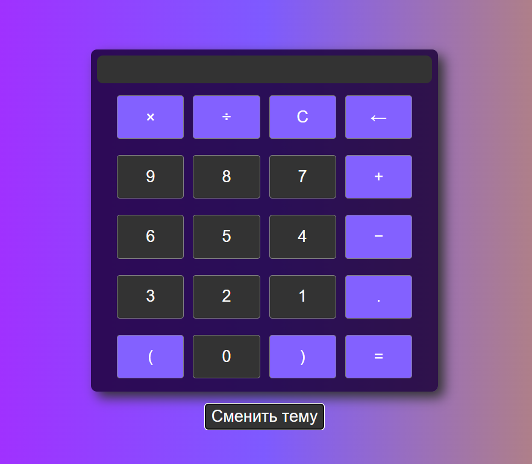
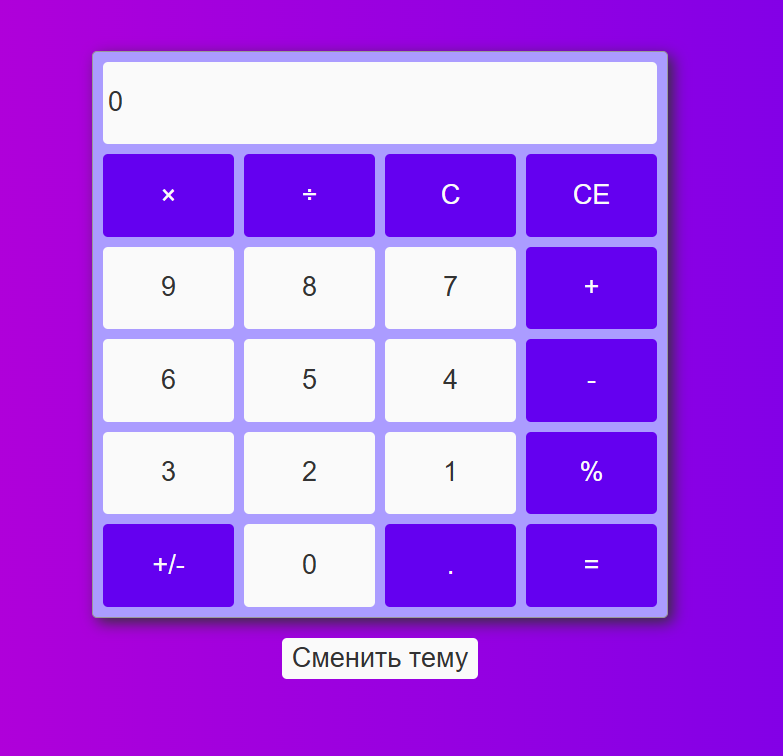
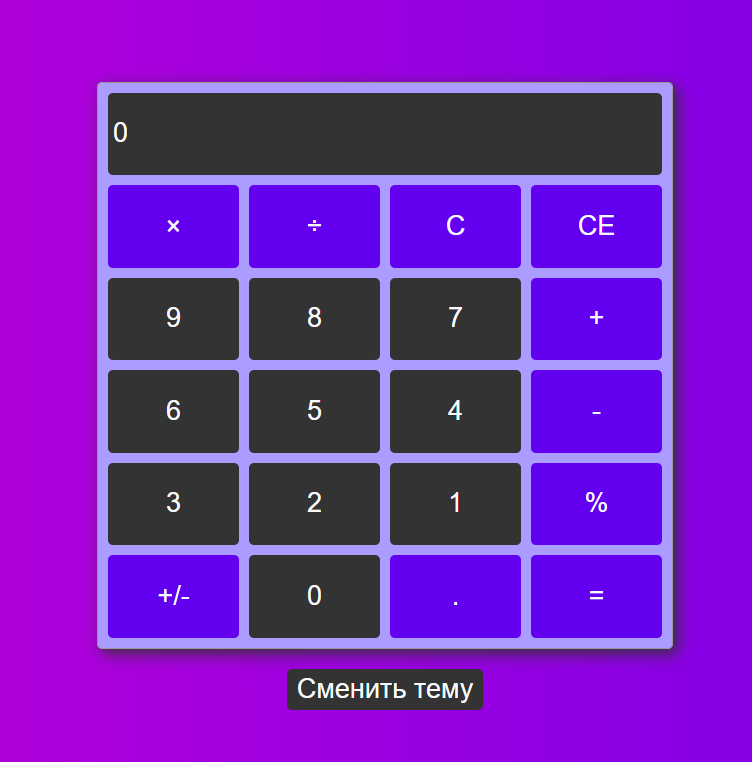

# Калькулятор

Калькулятор на HTML/CSS + JS с адаптивным дизайном.

## Текущий статус

Завершён✅

## Версии проекта

### Версия 2

#### Особенности V2

- Адаптивность под мобильные устройства.
- Поддержка скринридеров благодаря ARIA-атрибутам.
- Выделение операций другим цветом.
- Использование CSS-переменных.
- Переключение на тёмную/светлую тему.
- Базовые вычисления (+, -, ×, ÷, %).
- Работа с дробными числами.
- Проведение действий с результатом вычислений.
- Полный сброс (C), Удаление одного элемента(CE).
- Смена знака у числа.
- Использование SCSS.
- Добавление файла gitignore для исключения ненужных файлов.
- Добавление анимации уменьшения для кнопок.

#### Технологии V2

- HTML5 - макет калькулятора.
- CSS3 - flexbox, grid, адаптивный дизайн, CSS-переменные, анимации.
- ARIA - атрибуты для доступности.
- JS - смена темы, логика калькулятора.
- SCSS - облегчение написания CSS.

### Версия 1

#### Особенности V1

- Адаптивность под мобильные устройства.
- Поддержка скринридеров благодаря ARIA-атрибутам.
- Выделение операций другим цветом.
- Использование CSS-переменных.
- Переключение на тёмную/светлую тему.
- Базовые вычисления (+, -, ×, ÷).
- Полный сброс (C).

#### Технологии V1

- HTML5 - семантическая разметка.
- CSS3 - flexbox, адаптивный дизайн, CSS-переменные.
- ARIA - атрибуты для доступности.
- JS - смена темы, логика калькулятора.

## Скриншоты V1

## Скриншоты V2

