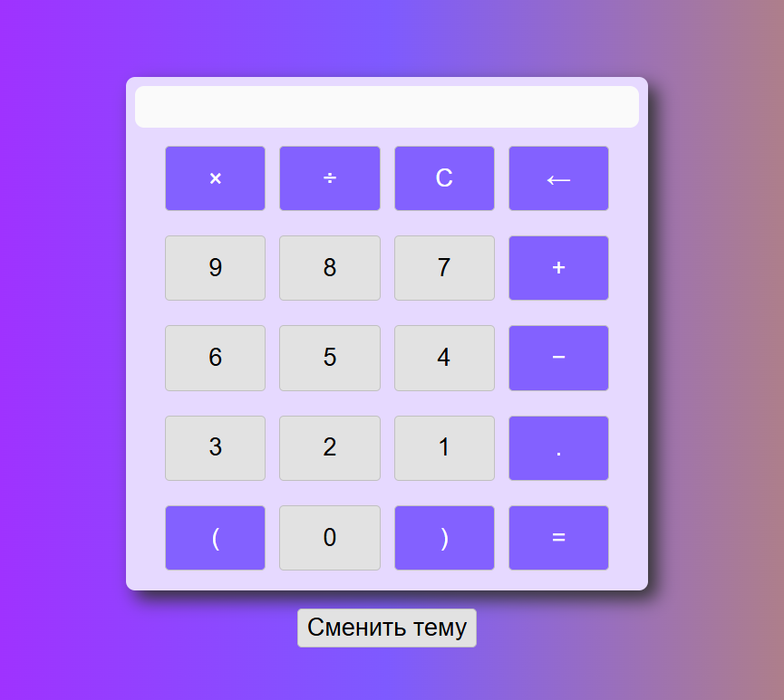

# Калькулятор

Простой калькулятор на HTML/CSS с адаптивным дизайном.

## Особенности

- Адаптивность под мобильные устройства.
- Поддержка скринридеров благодаря ARIA-атрибутам.
- Выделение операций другим цветом.
- Использование CSS-переменных.
- Переключение на тёмную/светлую тему.

## Технологии

- HTML5 - семантическая разметка.
- CSS3 - flexbox, адаптивный дизайн, CSS-переменные.
- ARIA - атрибуты для доступности.
- JS - смена темы.

## Скриншоты

